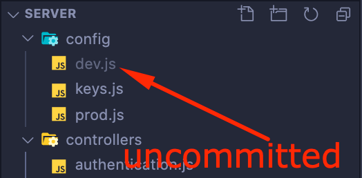

# REST API for LEM (Line Efficiency Monitoring) System

[**LEM System**](https://riverdi-lem.netlify.app/) is an internal tool for measuring and monitoring manufacturing/production lines.

The project was created as the [final project](https://cs50.harvard.edu/x/2020/project/) to graduate [Harvard&#39;s CS50](https://cs50.harvard.edu/x/2020/) for benefit of my colleagues at Manufacturing Department of [Unisystem](https://www.unisystem-displays.com/en/) and [Riverdi](https://riverdi.com/) (Industrial display and touch screen manufacturer).

The application has to solve some issues that my folks have to tackle on daily basis.

## The main features of LEM System:

**The software has to:**

1. Utilize bar-code scanners (in fact, it is not a bar code but [Data Matrix](https://en.wikipedia.org/wiki/Data_Matrix) – it&#39;s 2D code, somewhat similar to QR Code) that the company bought for scanning newly developed stickers that are placed on ready made products (as input data)
2. Read MS Excel file with production schedule and part number details and retrieve data about tact times, part numbers and orders to work with.
3. Give an instant feedback about MCT LCT efficiency, estimated duration of the order and estimated time of order completion. (also with colors - GREEN and RED so people can instantly see if they are winning or losing)
4. Give an information about Order, customer, manufactured piece (part number), ordered quantity
5. Give an information about missing pieces
6. Give an information of mixed up pieces (for example the same part number but form another order from same or another client
7. Give feedback about counting one piece more than once
8. Give information about how many pieces (of current order) was done on current line and on all the lines and how many pieces are to do
9. Give ability to have brakes during completion the given order
10. Give ability to work on more than one line
11. Give ability to start an order on one line and finish it on another
12. Give ability work on more than one order simultaneously
13. Give ability to work on the same (big) order on more than one line at the same time
14. Handle users (production workers, service, foremen and managers) accounts (with authorization and authentication)
15. When user reserves a line, the line has to be unavailable to another user until it is released

**Future:**

1. Manager dashboard with:
2. Statistics: orders, users, lines, errors, times, partnumbers
3. User account management
4. Line management
5. Order and work scheduling (← that one, can be implemented only when the application will be independent form this huge excel spreadsheet that is currently a bread and butter of all department and everything is based on it)

The app is meant to work with some kind of frontend. In this particular system, there is SPA (Single Page Application) in React created for this job ([app](https://riverdi-lem.netlify.app/)), [code](https://github.com/thembones79/lem-client#readme)).

LEM System is meant to be an internal tool, so there is no "sign up" feature. Users can not add themselves to the system, they can be added only by admin/manager.

### Install:

```
npm install
```

### Run:

```
npm run dev
```

The app listens on port 3090 if PORT is not provided in environmental variable.

#### Please note that the application has "config" directory.

The "config" directory should have three files:

- Keys.js (committed to the repository – consists of logic determining if the app is currently in production or development environment and uses one of described below config files accordingly)
- Prod.js (all secrets, api keys, MongoDB connection strings are taken here from environmental variables. In this particular case I&#39;m using Heroku environment)
- Dev.js (UNCOMMITTED! – you have to create it yourself and put there MongoDB connection string and secret string (long, random string is needed to properly generate JWTs). Please add this file to your ".gitignore" and never send or commit it anywhere!)
<p align="center">
  
</p>

---

### Usage _(note: this is a REST API and it is supposed to be used by some kind of frontend, SPA preferably, or a mobile app)_:

---

**Route (unprotected): `/signin`**

> Request: `POST`
>
> Request Body: `{email, password}`
>
> Response: `{token, userId, username, userType}`

_**Feature:** allows existing user to "sign in" - gives user a valid JSON Web Token that can be used to make other protected API requests_

---

**Route (protected): `/api/line`**

> Request: `POST`
>
> Request Body: `{lineNumber}`
>
> Request Security Headers: `{authorization: validJsonWebTokenString}`
>
> Response: `{message: confirmationMessage}`

_**Feature:** allows user to add new production line_

---

**Route (protected): `/api/lines`**

> Request: `GET`
>
> Request Security Headers: `{authorization: validJsonWebTokenString}`
>
> Response: `{lines}`

_**Feature:** fetches all lines data_

---

**Route (protected): `/api/line/status`**

> Request: `PUT`
>
> Request Body: `{lineId, lineStatus}`
>
> Request Security Headers: `{authorization: validJsonWebTokenString}`
>
> Response: `{message: confirmationMessage}`

_**Feature:** changes chosen line ("lineId") status to lineStatus sent in the request&#39;s body_

---

**Route (protected): `/api/user`**

> Request: `POST`
>
> Request Body: `{firstname, lastname, email, password, type}`
>
> Request Security Headers: `{authorization: validJsonWebTokenString}`
>
> Response: `{userType: user.type, userName: user.firstname, userId: user._id,}`

_**Feature:** create a new user with data provided in the request&#39;s body (important! New users can be added only by managers/admins – standard user would get 422 error with message: **"You do not have privileges to add new user!"** )_

---

**Route (protected): `/api/order`**

> Request: `POST`
>
> Request Body: `{orderNumber, quantity, partNumber, qrCode, customer, tactTime}`
>
> Request Security Headers: `{authorization: validJsonWebTokenString}`
>
> Response: `{order}`

_**Feature:** adds new order_

---

**Route (protected): `/api/order/close`**

> Request: `PUT`
>
> Request Body: `{orderNumber}`
>
> Request Security Headers: `{authorization: validJsonWebTokenString}`
>
> Response: `{message: confirmationMessage}`

_**Feature:** closes (existing and opened) order_

---

**Route (protected): `/api/orders`**

> Request: `GET`
>
> Request Security Headers: `{authorization: validJsonWebTokenString}`
>
> Response: `{orders}`

_**Feature:** fetches all orders data_

---

**Route (protected): `/api/order/:dashedordernumber`**

> Request: `GET`
>
> Request Security Headers: `{authorization: validJsonWebTokenString}`
>
> Response: `{existingOrder}`

_**Feature:** fetches chosen order full data_

---

**Route (protected): `/api/order/:dashedordernumber`**

> Request: `DELETE`
>
> Request Security Headers: `{authorization: validJsonWebTokenString}`
>
> Response: `{message: confirmationMessage}`

_**Feature:** deletes chosen order_

---

**Route (protected): `/api/scan`**

> Request: `POST`
>
> Request Body: `{scanContent, errorCode, _line, _user}`
>
> Request Security Headers: `{authorization: validJsonWebTokenString}`
>
> Response: `{existingOrder}`

_**Feature:** adds new scan to the chosen order and chosen line_

---

**Route (protected): `/api/menu`**

> Request: `POST`
>
> Request Body: `{menuContent, timeStamp}`
>
> Request Security Headers: `{authorization: validJsonWebTokenString}`
>
> Response: `{existingMenu}`

_**Feature:** overwrites existing order menu with new one (with new time stamp as synchronization indicator and sanity check. Order menu consists orders that have to be processed by manufacture department, and the application. This route is meant to be hit not by regular frontend, but by another node service that takes company&#39;s internal data – excel spreadsheet – processes it and sends to the API in 10 minute intervals)._

---

**Route (protected): `/api/menu`**

> Request: `GET`
>
> Request Security Headers: `{authorization: validJsonWebTokenString}`
>
> Response: `{timestamp, menuContent}`

_**Feature:** fetches updated order menu content with a last update time stamp_

---

**Route (protected): `/api/break/start`**

> Request: `POST`
>
> Request Body: `{orderNumber, _line}`
>
> Request Security Headers: `{authorization: validJsonWebTokenString}`
>
> Response: `{existingOrder}`

_**Feature:** creates a new break in chosen order on chosen line (and adds time stamp to the breakStart property)_

---

**Route (protected): `/api/break/end`**

> Request: `POST`
>
> Request Body: `{orderNumber, _line}`
>
> Request Security Headers: `{authorization: validJsonWebTokenString}`
>
> Response: `{existingOrder}`

_**Feature:** adds a breakEnd time stamp_ _to the last break without a breakEnd_ _in chosen order on chosen line (and adds time stamp to the breakStart property)_

---

### The application also checks correctness of barcode reader scans.

The app divides the code from the scan into 2 parts:

1. the main code (I have called it "qrCode", which takes it from your Excel and assumes that it is correct and that it can change, because, for example, a manager came up with a different pattern to generate and I will not predict it)
2. and attached to it a (five-digit) number from 00001 to the given quantity

When it comes to validation, the app checks:

1. is the part before the number the same as the code taken from your excel (if not, it gives the code `e003 - "wrong code"`)
2. whether the number is in the given range (if not, it gives an error `e002 - "out of range"` )
3. if the number was not repeated (if it repeated, it gives error `e001 - "repeated scan"`)
4. if there is no error from the above it returns `e000 - "OK"` and **counts this scan**

Thanks to this, manager can change the pattern in Excel that generates the basis of the sticker code and theoretically nothing should go wrong

Error codes will be used in the future for statistical purposes.

Besides time efficiency, there are going to be statistics about errors on particular line, particular user, particular order, particular part number and all permutation of the above.

So it would be easier to estimate, for example, which partnumber is "harder" to make, or who needs some more training, or which line has mixed up components, or which line needs extra help from quality department or from other line to deliver on time, etc.
